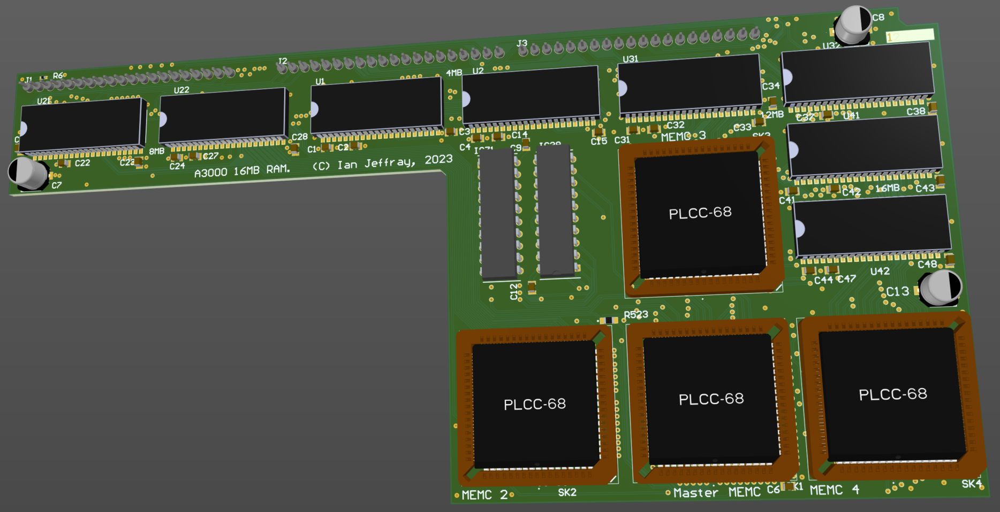

# Acorn A3000 16MB RAM board

March 2023

This is an UNFINISHED Work-in-progress implementation of a 16MB RAM upgrade for Acorn A3000 machines.
It will require two PALs to be lifted/copied from the A540 - work in progress to create implementations to program in to new parts.
This is currently essentially no more than a "progressed idea" with lots still to do!

## Licence

No warranty is provided, and this work is used at your own risk.  

Licenced as CC BY-SA 3.0

Copyright 2023 Ian Jeffray

