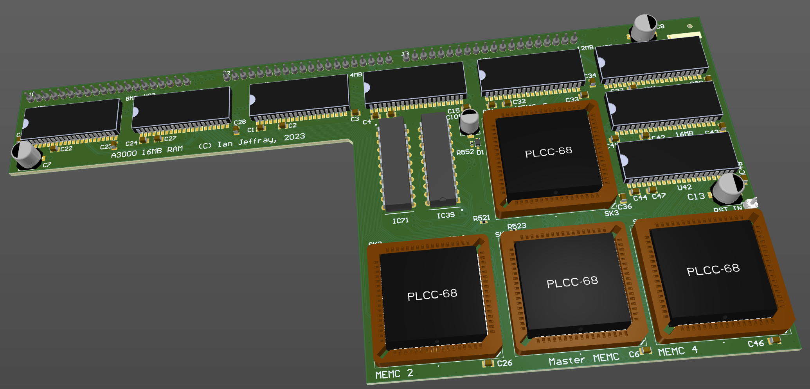

# Acorn A3000 16MB RAM board

October 2023

A 16MB RAM upgrade for Acorn A3000 machines.  Two PALs (IC39,IC71) are copies of those from the A540.

The first spin of the design has been built and tested, with some design errors and PCB-level errors noted, though proven functional and reliable under regular use and under memory stress test situations.

The updated/corrected design has not yet been built or tested.

## Licence

No warranty is provided, and this work is used at your own risk.  

Licenced as CC BY-SA 3.0

Copyright 2023 Ian Jeffray

